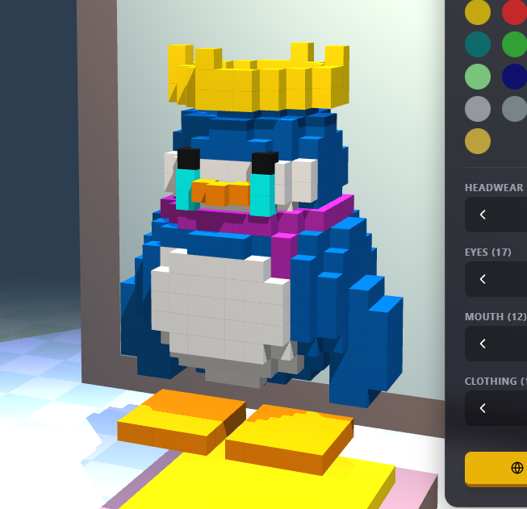

# 🐧 Waddlebet

<div align="center">



**The First Trencher Social Platform on Solana**

*Culture-powered Web3 gaming with wagering, tradeable cosmetics, and virtual property rentals.*

[](https://solana.com)
[](LICENSE)
[]()

[Whitepaper](./whitepaper) • [Vision & Direction](./documentation/VISION.md) • [Play Now](https://waddlebet.fun) • [Community](https://x.com/i/communities/1998537610592137381) • [Buy $WADDLE](https://pump.fun/coin/63RFxQy57mJKhRhWbdEQNcwmQ5kFfmSGJpVxKeVCpump)

</div>

---

> **🌟 Vision Statement:** Waddlebet is the evolution of social gaming metaverses. We honor the nostalgia of Club Penguin while building something entirely new - a Web3-native platform where all communities (Penguins, Dogs, Frogs, and beyond) come together to play, trade, and create memories. This isn't a copy; it's the next generation.

---

## 🎮 What is Waddlebet?

Waddlebet is a **Web3 social gaming metaverse** that evolves beyond classic penguin games into a welcoming ecosystem for all communities. Built on Solana, we've taken the nostalgic charm of penguin social games and supercharged it with Web3 technology, cross-community support, and features that surpass anything Club Penguin ever offered.

**Our Vision:** A metaverse where all Web3 communities feel at home - from nostalgic Club Penguin veterans to Dogecoin/Doginals enthusiasts, Pepe frog collectors, and beyond. We're not a copy; we're the evolution.

### Core Philosophy

- **🐧 Penguin Nostalgia** - We honor the Club Penguin heritage with igloos, penguins, and the social experience you remember, capturing that original user base
- **🐕 Multi-Community Support** - Dogs for the Dogecoin/Doginals community, Frogs for the Pepe community, and room to grow
- **🌐 Web3 Native** - Built from the ground up for Web3 with Solana integration, token gating, and true digital ownership
- **🚀 Beyond the Original** - Features Club Penguin never had: real property ownership, token wagering, tradeable NFTs, and cross-community mingling

### What Makes Us Different

- **🏢 GTA V-Style Properties** - Own and rent spaces, apartments, and lounges. Set paywalls with any Solana token
- **🔄 RuneScape Trading** - True digital ownership with tradeable cosmetics via gacha system
- **💎 Multi-Character Support** - Play as penguins, dogs, frogs, and more - all in one metaverse
- **🎮 Web3 Gaming** - Token-gated minigames, P2P wagering with any token, and real value exchange

---

## ✨ Features

### 🎨 Deep Customization & Multi-Character Support
- **Multiple Character Types** - Play as Penguins, Dogs (Doginals), Frogs (Pepe), Whales, and Marcus
- **Character-Specific Customization** - Each character type has unique appearance options
- **24+ Colors Per Character** - From classic variants to legendary rainbow and ghost variants
- **17+ Headwear Options** - Crowns, viking helmets, party hats, ninja masks (compatible across types)
- **17+ Eye Styles** - Normal, shades, angry, sleepy, hearts, stars
- **12+ Mouth Options** - Beaks, smiles, beards, and character-specific expressions
- **20+ Clothing Items** - Scarves, hoodies, suits, and exclusive outfits
- **Character Homes** - Penguins get igloos, Dogs get doghouses, Frogs get ponds - each community feels at home

### 🎮 Minigames
- **Card Jitsu** - Fire beats Snow, Snow beats Water, Water beats Fire
- **Connect 4** - Classic four-in-a-row strategy
- **Tic Tac Toe** - Quick matches, high stakes
- **Pong** - Fast reflexes, winner takes all
- *More coming soon...*

### 🐾 Pet Companions
Adopt fluffy puffle pets with tiered rarity:
- **Common** - Blue, Red, Green (50 coins)
- **Uncommon** - Pink, Yellow, Orange (100 coins)
- **Rare** - Purple, White, Brown (200 coins)
- **Epic** - Black, Gold (500 coins)
- **Legendary** - Rainbow, Ghost (1000 coins) - *Special effects!*

### 💰 $WADDLE Token Economy
The native platform token powers the ecosystem:
- **Property Rentals** - Rent spaces, apartments, and exclusive spaces
- **Gacha System** - Spend $WADDLE to unlock rare, tradeable cosmetics
- **Trading** - All items are tradeable between players

### 🎲 P2P Wagering
Bet on minigames with **any Solana token**:
- $SOL, $WADDLE, $BONK, $WIF, $PENGU, or any SPL token
- You choose the token, you set the stakes
- Winner takes all with instant Solana settlement

### 🏠 Virtual Properties
GTA V-style property system:
- Rent spaces and apartments
- Customize your space
- Set paywalls with any token
- Invite players for exclusive hangouts

---

## 🗺️ Game World

### Current Locations
- **Town Center** - Central hub with shops and social areas
- **The Dojo** - Battle arena for Card Jitsu

### Coming Soon
- **Ski Village** - Northern mountain area with winter sports
- **Plaza** - Eastern area with Pet Shop and Stage
- **Beach & Dock** - Southern coastline with lighthouse
- **Forest & Cove** - Dense forest trails and hidden areas
- **Underground Mines** - Crystal caverns and mine cart rides

---

## 🚀 Getting Started

### Prerequisites
- Node.js 18+ 
- npm or yarn

### Installation

1. **Clone the repository**
   ```bash
   git clone https://github.com/Tanner253/waddlebet.git
   cd waddlebet
   ```

2. **Install dependencies for the game**
   ```bash
   cd waddlebet
   npm install
   ```

3. **Run the game demo**
   ```bash
   npm run dev
   ```
   Open [http://localhost:5173](http://localhost:5173) in your browser.

4. **Run the server (for multiplayer)**
   ```bash
   npm run dev:server
   ```

5. **Run both client and server**
   ```bash
   npm run dev:all
   ```

### Running the Whitepaper Site

1. **Navigate to whitepaper folder** (from repo root)
   ```bash
   cd whitepaper
   ```

2. **Install dependencies**
   ```bash
   npm install
   ```

3. **Run the development server**
   ```bash
   npm run dev
   ```
   Open [http://localhost:3000](http://localhost:3000) in your browser.

---

## 📁 Repository Structure

```
waddlebet/
├── waddlebet/          # Game client & server
│   ├── src/            # React frontend
│   ├── server/         # Node.js backend
│   ├── public/         # Static assets
│   └── package.json    # Game dependencies
├── whitepaper/         # Documentation site (Next.js)
├── documentation/      # Technical docs & specs
├── LICENSE
└── README.md
```

---

## 🎮 Controls

| Key | Action |
|-----|--------|
| `W` / `↑` | Move Forward |
| `S` / `↓` | Move Backward |
| `A` / `←` | Turn Left |
| `D` / `→` | Turn Right |
| `E` | Interact / Emote Wheel |
| `Enter` | Open Chat |
| `Mouse` | Orbit Camera |

---

## 🛠️ Tech Stack

### Game Client
- **React** - UI Framework
- **Three.js** - 3D Graphics Engine
- **Vite** - Build Tool
- **Tailwind CSS** - Styling

### Whitepaper Site
- **Next.js 14** - React Framework
- **TypeScript** - Type Safety
- **Framer Motion** - Animations
- **Tailwind CSS** - Styling

### Blockchain
- **Solana** - Fast, low-fee transactions
- **SPL Tokens** - Multi-token support

---

## 📍 Roadmap

### Phase 1: Foundation ✅
- [x] 3D Voxel World Engine
- [x] Multi-Character System (Penguin, Dog, Frog support)
- [x] Character-Specific Homes (Igloos, Doghouses, Ponds)
- [x] Pet Companion System
- [x] Card Jitsu Minigame
- [x] AI NPCs & Social Features
- [x] Property Rental System
- [x] Playable Demo Release

### Phase 2: Multi-Community Expansion (Current) 🚧
- [x] Dog Character Support (Doginals community)
- [x] Frog Character Support (Pepe community)
- [x] Character-Specific Customization
- [x] Space Type System (igloo, doghouse, pond, etc.)
- [ ] Community-Specific Events (Dogecoin Day, Pepe Day)
- [ ] Cross-Community Minigames
- [ ] Additional Locations (Beach, Ski Village, Plaza)
- [x] Additional Minigames (Connect 4, Tic Tac Toe, UNO, Blackjack, Battleship, Monopoly)

### Phase 3: Web3 Economy ✅
- [x] P2P Wagering System
- [x] Multi-Token Support (any Solana token)
- [x] x403 Integration (gasless wagering)
- [x] x402 Integration (signature-based auth)
- [x] Gacha System Launch
- [x] Tradeable Cosmetics Marketplace
- [x] Property Paywalls
- [ ] Leaderboards & Rankings

### Phase 4: Community & Culture 🌟
- [ ] Community DAOs (governance for each community)
- [ ] Creator Economy (custom content creation)
- [ ] Seasonal Community Events
- [ ] Cross-Community Tournaments
- [ ] Advanced Social Features
- [ ] Mobile Companion App
- [ ] Additional Character Types (based on community demand)

---

## 🔗 Links

| Resource | Link |
|----------|------|
| 🎮 **Play Now** | [waddlebet.fun](https://waddlebet.fun) |
| 🌐 **Whitepaper** | [View Whitepaper](./whitepaper) |
| 🐦 **X Community** | [Join Community](https://x.com/i/communities/1998537610592137381) |
| 💰 **Buy $WADDLE** | [PumpFun](https://pump.fun/coin/63RFxQy57mJKhRhWbdEQNcwmQ5kFfmSGJpVxKeVCpump) |
| 📦 **GitHub** | [Repository](https://github.com/Tanner253/waddlebet) |

---

## 📜 Contract Address

```
63RFxQy57mJKhRhWbdEQNcwmQ5kFfmSGJpVxKeVCpump
```

---

## ⚠️ Disclaimer

**Waddlebet is currently in active development.** Features, tokenomics, and gameplay mechanics described in this repository are subject to change. This is not financial advice. Always do your own research before participating in any cryptocurrency projects.

---

## 📄 License

This project is licensed under the MIT License - see the [LICENSE](LICENSE) file for details.

---

<div align="center">

**Built with ❄️ by the Waddlebet Team**

*Waddle on!* 🐧

</div>
