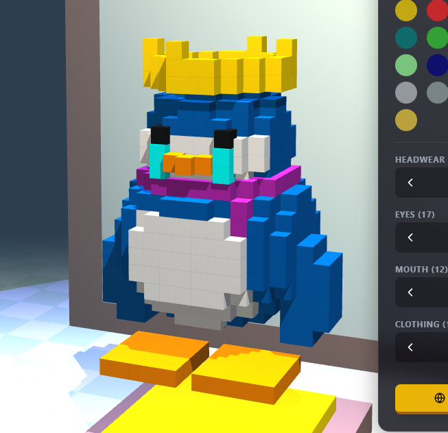
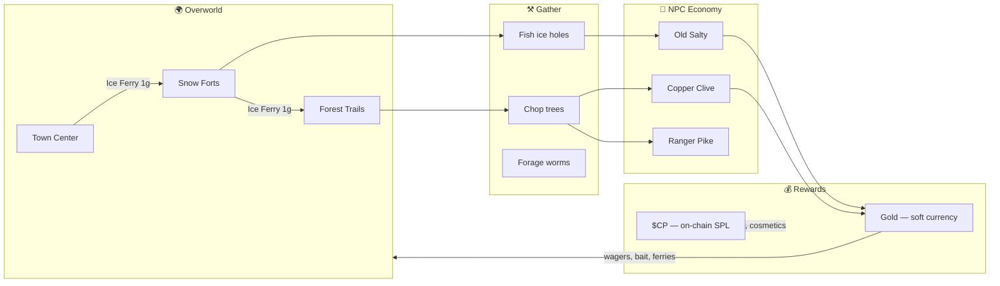
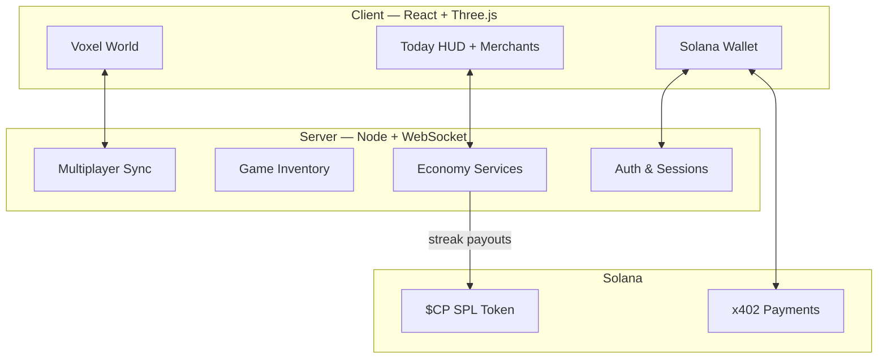

# Waddlebet

<div align="center">



### The penguin MMO that pays you to play.

**Club Penguin nostalgia. Solana ownership. A living economy you can actually grind.**

[](https://waddle.bet)
[](https://solana.com)
[](LICENSE)

[Whitepaper](./whitepaper) · [Community](https://x.com/i/communities/1998537610592137381) · [$CP on Pump](https://pump.fun/coin/PSNFtAvpVSZDFjRScGkKxMdEYArRr6LvScwmuYRpump)

</div>

---

## The hook

You waddle into a **3D voxel world** with your friends, customize your penguin, adopt puffles, and hang out like the old days — except your wallet is connected, your cosmetics can be tradeable, and **showing up every day earns real $CP**.

This isn't a menu of disconnected minigames. It's a **connected overworld**: ferry across the ice, fish the holes, chop the forest, strike deals with NPC merchants, wager SPL tokens on PvP, and rent igloos — all in one persistent multiplayer session.

---

## How the world works


```mermaid
flowchart LR
    subgraph WORLD["🌍 Overworld"]
        T[Town Center]
        S[Snow Forts]
        F[Forest Trails]
        T -->|Ice Ferry 1g| S
        S -->|Ice Ferry 1g| F
    end

    subgraph GATHER["⚒️ Gather"]
        FISH[Fish ice holes]
        WOOD[Chop trees]
        FORAGE[Forage worms]
    end

    subgraph NPCS["🏪 NPC Economy"]
        SALTY[Old Salty]
        CLIVE[Copper Clive]
        PIKE[Ranger Pike]
    end

    subgraph REWARD["💰 Rewards"]
        GOLD[Gold — soft currency]
        CP[$CP — on-chain SPL]
    end

    S --> FISH
    F --> WOOD
    FISH --> SALTY
    WOOD --> CLIVE
    WOOD --> PIKE
    SALTY --> GOLD
    CLIVE --> GOLD
    GOLD -->|wagers, bait, ferries| WORLD
    CP -->|streak, rent, cosmetics| REWARD
```

**Gold** is infinite soft currency — ferries, bait, casino, puffles, PvP gold wagers.  
**Wood & fish** are progression — upgrade axes, rods, and backpack tiers at merchants.  
**$CP** is the on-chain SPL token — daily login streak, igloo rent, SPL wagers, cosmetic bazaar.

Gold and $CP are **separate layers**. Grinding fish doesn't print tokens. Showing up, playing, and completing contracts does.

---

## What you actually do

### Explore & socialize
Walk a live multiplayer voxel map with real players. Emotes, chat, puffles, igloos, and the vibe of classic penguin social games — rebuilt for Web3.

### Gather & progress
- **Snow Forts** — pick up your rod, fish the ice, sell your catch  
- **Forest Trails** — chop pine, birch, oak; upgrade your axe and backpack with wood (not gold)  
- **Captain Skipper's Ice Ferry** — 1g between zones  

Gear tiers matter. Better rod = better fish prices. Better axe = faster wood. Backpack size gates how much you haul before heading back to town.

### Daily contracts (the habit loop)
Visit **Old Salty** or **Copper Clive**, accept today's contract from the trader UI, track progress on your **Today** HUD, return and turn in for a gold bonus. Miss a day? Streak resets. Show up? Escalating rewards.

### 7-day login streak
Play 60 minutes per UTC day and claim from your calendar:

| Day | Reward |
|-----|--------|
| 1 | 1,000 $CP |
| 2 | 2,000 $CP |
| 3 | **5g** (gold day) |
| 4 | 3,000 $CP |
| 5 | 4,000 $CP |
| 6 | **10g** (gold day) |
| 7 | 5,000 $CP |

$CP days scale 1k → 5k. Days 3 & 6 are gold-only — pocket change for ferries and bait, balanced for early market cap.

### Wager anything
Challenge players to Card Jitsu, Connect 4, Tic Tac Toe, Pong, Blackjack, and more — stake **gold or any SPL token** including $CP, $SOL, $BONK. Winner takes the pot. Instant Solana settlement.

### Own & flex
- **24+ colors**, hats, eyes, mouths, outfits — legendary rainbow and ghost variants  
- **Puffles** from common to legendary with special effects  
- **Igloo rentals** paid in $CP  
- **Whale nametags** tied to $CP balance tiers  
- **Pebbles** (SOL-backed) for gacha and the cosmetic bazaar — separate from the grind cash-out path  

---

## The merchant experience

NPCs aren't text menus anymore. **Tarkov-style trader panels** — typewriter dialogue, tabbed offer grids, animated contract art, material breakdown bars, accept → track → turn in.

| NPC | What they do |
|-----|----------------|
| **Old Salty** | Buys fish, sells rods & bait, daily catch contracts |
| **Copper Clive** | Axes, backpack upgrades, wood mint recipes, timber contracts |
| **Ranger Pike** | Emergency timber sell (65%), mushroom ferry quest |
| **Captain Skipper** | Ice Ferry captain |

---

## $CP utility

$CP is not decoration. It's the token that connects gameplay to ownership:

- **7-day login streak** — escalating on-chain rewards for daily play  
- **Igloo rent** — virtual property subscriptions  
- **SPL wagers** — bet $CP on PvP minigames  
- **Cosmetic bazaar** — tradeable skins (Pebbles path for premium gacha)  
- **Whale status** — balance-tier nametags with animated effects  

Full tokenomics, economy diagrams, and changelog: **[whitepaper](./whitepaper)** (live site with canvas visuals).

---

## Architecture at a glance


```mermaid
flowchart TB
    subgraph CLIENT["Client — React + Three.js"]
        VW[Voxel World]
        HUD[Today HUD + Merchants]
        WALLET[Solana Wallet]
    end

    subgraph SERVER["Server — Node + WebSocket"]
        AUTH[Auth & Sessions]
        INV[Game Inventory]
        ECON[Economy Services]
        MP[Multiplayer Sync]
    end

    subgraph CHAIN["Solana"]
        CP[$CP SPL Token]
        X402[x402 Payments]
    end

    VW <--> MP
    HUD <--> ECON
    WALLET <--> AUTH
    ECON -->|streak payouts| CP
    WALLET <--> X402
```

Server-authoritative inventory, fishing, woodcutting, and economy. Client renders; server decides. MongoDB for persistence. Custodial wallet for $CP streak payouts.

---

## Repo layout

| Path | What it is |
|------|------------|
| [`waddlebet/`](waddlebet/) | Game client + multiplayer server |
| [`whitepaper/`](whitepaper/) | Public docs site — tokenomics, economy visuals, changelog |
| [`waddlebet/docs/`](waddlebet/docs/) | Internal design docs for active development |

---

## Run locally

```bash
cd waddlebet && npm install && npm run dev:all
```

Client → `http://localhost:5173` · Server restarts required after economy pulls.

```bash
cd whitepaper && npm install && npm run dev
```

Docs site → `http://localhost:3000`

---

## Links

| | |
|---|---|
| **Play** | [waddle.bet](https://waddle.bet) |
| **Whitepaper** | [whitepaper.waddle.bet](https://whitepaper.waddle.bet) |
| **$CP mint** | `PSNFtAvpVSZDFjRScGkKxMdEYArRr6LvScwmuYRpump` |
| **GitHub** | [Tanner253/waddlebet](https://github.com/Tanner253/waddlebet) |

---

<div align="center">

*Waddlebet was formerly Club Pengu / Club Penguin on Solana. Same team, bigger vision.*

**Built with ❄️ — Waddle on!** 🐧

Not financial advice. Active development — mechanics may change.

</div>
