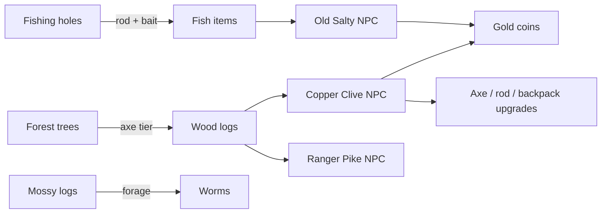

# Waddlebet — Game Client & Server

<div align="center">

**The playable core** — 3D voxel world, real-time multiplayer, server-authoritative economy.

[Play live](https://waddle.bet) · [Whitepaper](../whitepaper) · [Root README](../README.md)

</div>

---

## What this package is

`waddlebet/` is the full stack: a **Vite + React + Three.js** client and a **Node.js WebSocket server** backed by MongoDB. Everything players touch — movement, inventory, fishing, woodcutting, NPC merchants, daily contracts, streak claims, wagers — runs through here.

The client renders. The server decides. Config in `server/config/` is authoritative; `src/config/` mirrors for UI display only.

---

## Systems

### Multiplayer world
Real-time player sync over WebSocket. Room-based zones (Town, Snow Forts, Forest Trails), Ice Ferry travel, NPC interactions, chat, emotes, puffles. `VoxelWorld.jsx` is the main world shell; zone builders define each area's geometry and props.

### Game inventory
Server-authoritative grid inventory separate from cosmetic loadout. Fish, wood logs, tools, bait, ferry tickets — stack limits, hotbar, backpack tier gating. All gather/sell/craft actions validated server-side in `GameInventoryService`.

### Gathering loops



Trees regrow. Holes restock. Worms respawn on forageable logs. Progression is wood-gated gear, not gold purchases.

### NPC economy & contracts
Merchants defined in `worldNpcs.js` + `merchants.js`. Daily orders in `npcOrders.js`. Flow:

1. Player visits NPC → **Tarkov-style trader UI** (`NpcDialogueModal.jsx`)
2. Accept contract → tracked on **Today HUD** (`DailyQuestHUD.jsx`)
3. Gather materials → turn in → gold bonus via `NpcDailyOrderService`

### Daily streak ($CP)
`DailyBonusService` tracks session time (60 min required), enforces 24h cooldown, and pays escalating $CP from a custodial wallet. Days 3 & 6 are gold-only (no on-chain transfer). Calendar UI in `StreakCalendar.jsx`.

### Onboarding
9-step **Getting Started** quest gates daily bonus until complete. Teaches ferry → fish → sell → forest → chop → Clive → backpack upgrade. `OnboardingQuestService` advances steps server-side; HUD swaps to Today panel after reward.

### Wagering & casino
P2P challenges for minigames with gold or SPL tokens. `WagerToken` + Solana settlement. Gold slots and PvE blackjack as additional sinks. Card Jitsu in the Dojo with Sensei NPC.

### Auth & wallet
Solana wallet connect → JWT session. Persistent user record in MongoDB. Custodial payouts for daily $CP. x402 integration for premium flows.

---

## Key services (server)

| Service | Responsibility |
|---------|----------------|
| `GameInventoryService` | Inventory CRUD, sell, mint, emergency sell |
| `FishingService` / `FishingHoleService` | Catch rolls, hole stock |
| `WoodcuttingService` / `ForestTreeService` | Chop validation, tree regrowth |
| `NpcDailyOrderService` | Daily contract accept & turn-in |
| `DailyBonusService` | Streak calendar, $CP payout |
| `OnboardingQuestService` | 9-step new-player quest |
| `UserService` | Gold balance, transactions |
| `TravelService` | Ice Ferry between zones |

---

## Key client surfaces

| Component | What players see |
|-----------|------------------|
| `VoxelWorld.jsx` | Main 3D world |
| `VoxelPenguinDesigner.jsx` | Penguin creator + tokenomics pitch |
| `NpcDialogueModal.jsx` | Merchant trader UI |
| `DailyQuestHUD.jsx` | Today panel — contracts + streak |
| `GameInventoryModal.jsx` | Backpack grid |
| `WagerModal.jsx` | P2P stake setup |
| `EconomyGuideModal.jsx` | In-game economy explainer |

---

## Economy config (source of truth)

```
server/config/
  goldEconomy.js      — starting coins, sell ratios, version
  npcOrders.js        — daily contract requirements & rewards
  dailyBonusStreak.js — 7-day calendar tiers
  merchants.js        — NPC buy/sell tables
  economy.js          — wood values, mint recipes
  fishingLoot.js      — catch tables by rod tier
  woodcuttingLoot.js  — log yields by axe tier
```

Internal design docs: [`docs/ECONOMY_README.md`](docs/ECONOMY_README.md)

---

## Run & test

```bash
npm install
npm run dev          # client → :5173
npm run dev:server   # websocket server
npm run dev:all      # both

cd server && npm test   # 350+ unit tests
```

Restart the server after pulling economy or inventory changes.

---

<div align="center">

*Open source. Actively shipping. [Whitepaper](../whitepaper) for the public-facing story.*

</div>
