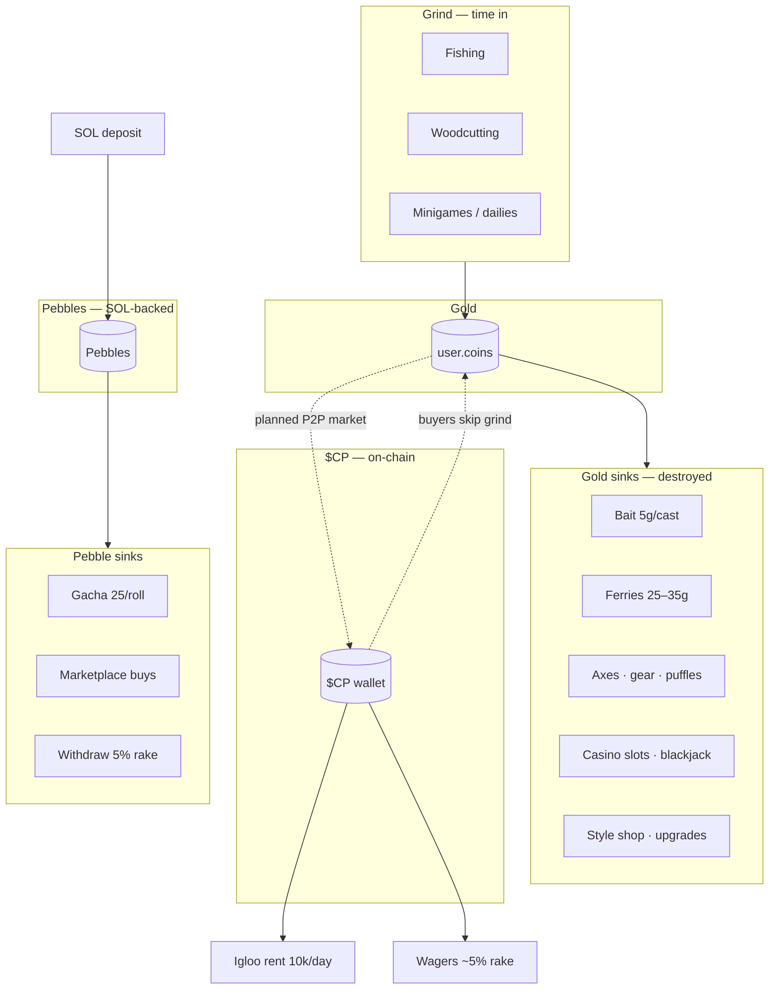

# WaddleBet — Economy & Product Brief (Investor / Partner)

> **June 2026** · Grounded in live `waddlebet` codebase + [ECONOMY_GROUNDED_PLAN.md](./ECONOMY_GROUNDED_PLAN.md)  
> Audience: investors, partners, senior stakeholders

---

## Executive summary

WaddleBet is a **3D social MMO** built on a crypto-native wagering and token economy. Players **grind gold** through fishing, woodcutting, and minigames (Runescape-style loops in a Club Penguin-style world), **spend premium Pebbles** on cosmetics (MapleStory-style gacha), and use **$CP** for on-chain utility — igloo rent, wagers, and (planned) buying gold from other players.

The product is **live today** with core loops, multiplayer, marketplace, and on-chain payments. The next phase adds **daily retention** (quest panel, NPC orders, spin wheel), **cosmetic ownership enforcement**, and a **player-driven gold ↔ $CP market** so grind time has real, sustainable value — without pegging gold to a treasury ratio or minting inflationary premium currency.

---

## What we have vs what we’re adding

| Area | Live today ✅ | Planned next 📋 |
|:-----|:--------------|:----------------|
| **World & multiplayer** | 3D town, ferries, forest, casino, dojo, igloos; real-time multiplayer | Zone level gates, expanded dailies, Phone UI for commerce |
| **Onboarding** | 9-step guided quest (500 gold) teaches full loop | Becomes permanent **“Today”** daily panel after completion |
| **Gathering** | Server-authoritative fishing + woodcutting; inventory grid | Crafting (lures, consumables); daily material orders |
| **Gold (soft currency)** | Earn: NPC sell, minigames, quests, casino. Spend: bait, ferries, axes, gear, puffles, slots | Daily orders, style shop (commons for gold), stronger sinks, telemetry |
| **Daily retention** | $CP bonus after 60 min (hidden in UI) | Visible **Today panel**: orders, tasks, bonus timer, daily spin wheel |
| **$CP (on-chain)** | Igloo rent (10k $CP/day), P2P wagers (~5% rake), daily bonus (5k $CP) | Gold marketplace (escrow), gold index / ledger, bounded bank liquidity |
| **Pebbles (premium)** | SOL deposit (1 SOL = 1,000 Pebbles); gacha (25 Pebbles/roll); cosmetic marketplace; 5% withdraw rake | Ownership enforced; FOMO-driven demand; unchanged inflation model |
| **Cosmetics** | 150+ gacha items; pebble marketplace; dupes → gold | Guests = defaults only; commons buyable with grind gold; mythics stay premium |
| **Casino** | Blackjack, gold slots (25g/spin, ~93% RTP), pebble slots | House edge funds treasury budget for gold buybacks |
| **Economy exit** | None — surplus gold has no $CP path | **Player listings** first; trade-derived gold price; optional bank ATM |
| **Telemetry** | Transaction logging | Economy dashboard: gold in vs out, $CP flows |

---

## Three currencies — one sentence each

| Currency | What players understand | Inflation? | Real-money link |
|:---------|:------------------------|:-----------|:------------------|
| **Gold** | “Money I earn playing.” | Soft — created by grind, destroyed by sinks | Indirect — sold to other players for $CP (planned) |
| **Pebbles** | “Premium coins I buy with SOL.” | **Not inflationary** — only created on SOL deposit | Direct — 1 SOL → 1,000 Pebbles; 5% rake on SOL withdrawal |
| **$CP** | “On-chain token for rent, wagers, and buying grind progress.” | External token supply (DEX); gameplay earn capped | Direct — Jupiter/DEX USD price |

**Why three, not one:** Gold optimizes for **hours played**. Pebbles optimize for **revenue and cosmetic status** without debasing grind. $CP optimizes for **on-chain utility and liquidity** between grinders and buyers.

---

## Gameplay loop (Club Penguin × Runescape)

### First session (onboarding — live)

```text
Town → Dojo (earn gold) → Ferry → Fish → Sell to Old Salty
     → Ferry → Chop wood → Sell to Clive → Upgrade backpack
```

Nine on-screen steps with hints — same pattern as Club Penguin’s guided tour, teaching the full economy in one session.

### Daily session (planned — Runescape / MapleStory habit)

```text
Login → “Today” panel shows:
  ☐ Salty’s catch order (bonus gold)
  ☐ Clive’s timber order (bonus gold)
  ☐ Daily spin wheel (free)
  ☐ Play 60 min → claim 5,000 $CP
  ☐ Optional: casino, igloo, marketplace, wagers

Loop: Fish/chop → turn in orders → spend gold on bait/travel/gear
      → surplus gold → list for $CP (planned) OR buy cosmetics with gold (commons)
```

### Player types (one world, three motivations)

| Player | Behavior | Pays |
|:-------|:---------|:-----|
| **Grinder** | Fish, chop, dailies, minigames | Time → earns gold → sells for $CP |
| **Buyer** | Rent igloo, wager, skip grind | $CP → buys gold from grinders |
| **Collector** | Gacha, marketplace, status cosmetics | SOL → Pebbles → rolls & trades |

---

## How the economy circulates



**Circulation principle:** Grinders create gold. Sinks remove gold. Buyers import $CP to acquire gold. Platform earns on spreads, rakes, and casino edge — not on printing gold or Pebbles.

---

## Sinks & faucets (by resource)

### Gold

| Faucets (create) | Sinks (destroy) |
|:-----------------|:----------------|
| Sell fish/wood to NPCs | Bait (5g per cast — perpetual) |
| Daily NPC orders (planned) | Ferry tickets (25–35g) |
| Onboarding, minigames, quests | Axes (100–3,800g), rod/backpack upgrades |
| Gacha duplicate refunds | Puffles (50–2,000g + upkeep) |
| Casino wins (offset by RTP) | Gold slots (25g/spin, ~7% house edge) |
| | Style shop commons (25k–150k, planned) |
| | Escrow lock while listing gold for $CP |

### Materials (fish, wood)

| Faucets | Sinks |
|:--------|:------|
| Fishing, woodcutting (server-validated) | Daily turn-in orders (planned) |
| | Gear upgrades (wood + gold) |
| | Crafting recipes (planned) |
| Emergency NPC sell (low rates) | |

### Pebbles

| Faucets | Sinks |
|:--------|:------|
| **SOL deposit only** (1 SOL = 1,000 Pebbles) | Gacha rolls (25 Pebbles) |
| Promo/gifts (non-withdrawable) | Marketplace purchases (player-to-player) |
| | 5% rake on SOL withdrawal |

### $CP

| Faucets | Sinks |
|:--------|:------|
| Daily bonus (5k, 60 min session) | Igloo rent (10k/day) |
| Wager wins | Wager losses + ~5% rake |
| Selling gold to buyers (planned) | Buying gold from grinders (planned) |
| | Bank/market spreads (planned) |

---

## What makes gold worth real ($CP) value

Gold is **not** backed by a fixed vault ratio (that model fails when grind outpaces reserves). Value comes from **competitive demand**:

### 1. Buyers who pay $CP voluntarily

New players, casuals, and hosts **don’t want 3 hours of fishing** — they pay grinders for gold to spend on bait, ferries, gear, and casino. This is the primary price engine (same pattern competitors use with trade-derived “gold price” charts).

### 2. Sinks that make hoarding costly

Perpetual bait cost, travel, upgrades, and casino edge mean **surplus gold wants an exit**. Without sinks, nobody needs to buy — price stays zero.

### 3. Floating market price (planned)

- More grinders → more gold listed → **lower $CP per gold** (commodity pricing, not a fixed wage)
- Escrow listings lock supply
- Public index from real trades × $CP/USD oracle
- No arbitrary “you earned enough today” caps — dedicated players can grind unlimited hours; **unit price adjusts**

### 4. Bounded treasury (safety net, not money printer)

- Platform allocates **% of revenue** (wager rake, pebble withdraw, rent, spreads) to a **TreasuryCPBudget** for optional bank buybacks
- When budget is empty, buybacks pause — P2P market sets price
- Bank bid/ask spread (~8%) is house edge, not a guarantee

### 5. In-game prestige (parallel track)

Expensive gold-only commons + enforced cosmetic ownership create **status demand** even before listing gold — MapleStory’s “farmable vs premium” split.

---

## Why Pebbles (not inflationary premium currency)

| Property | Pebbles | Typical “free premium coin” |
|:---------|:--------|:----------------------------|
| Creation | **Only on SOL deposit** | Daily login, ads, events → infinite supply |
| Withdrawal | SOL out minus 5% rake | Often none |
| Purpose | Gacha + cosmetic speculation | Generic shop |
| Gifted pebbles | Spendable, **not withdrawable** | N/A |

**Investor angle:** Every Pebble in circulation (minus gifts) was paid for with SOL. Gacha and marketplace **destroy Pebble velocity** (rolls + trades). Withdraw rake captures value on exit. This is a **closed premium loop**, not an inflationary soft currency.

**User angle:** “I know Pebbles cost real money. Mythic cosmetics mean something. I can trade them on the marketplace or cash out to SOL (minus fee).”

---

## Cosmetics & monetization

| Tier | How to get | Who it’s for |
|:-----|:-----------|:-------------|
| **Defaults** | Free (guests limited to defaults when enforcement ships) | Everyone |
| **Commons / uncommons** | Grind gold (style shop, planned) or daily wheel voucher | Dedicated free players |
| **Rare → mythic** | Pebble gacha + marketplace | Collectors, status seekers |
| **Duplicates** | Auto-convert to gold (existing) | Soft sink + grinder compensation |

**FOMO driver:** Enforcing ownership (`UNLOCK_ALL_COSMETICS` flip — code ready) means visible status in a multiplayer world. Club Penguin membership parallel: look unique in a social space.

---

## Platform revenue (existing + planned)

| Source | Status | Notes |
|:-------|:-------|:------|
| Pebble withdrawal rake | Live | 5% on SOL out |
| Wager rake | Live | ~5% on P2P wagers |
| Igloo rent | Live | 10,000 $CP/day flows to owners + protocol |
| Casino house edge | Live | Gold slots ~7% edge; blackjack RTP tuned |
| Gacha | Live | 25 Pebbles/roll; no Pebble mint on roll |
| Gold market rake | Planned | ~5% on escrow fills |
| Bank spread | Planned | ~8% round-trip on gold ↔ $CP |
| Marketplace | Live | No listing fee; liquidity drives Pebble deposits |

**Sustainability rule:** $CP outflows (buybacks, bonuses) funded by **revenue in**, not token mint. Gold supply managed by **sinks + price**, not hard player caps.

---

## Rollout (investor timeline)

| Phase | Deliverable | Business outcome |
|:------|:------------|:-----------------|
| **1** (next) | Daily Quest HUD + NPC orders | DAU habit; material demand |
| **2** | Daily tasks + spin wheel | Login streak; casino traffic |
| **3** | Cosmetic enforcement + gold style shop | FOMO; grinder progression |
| **4** | Economy telemetry | Data-driven tuning |
| **5** | Gold ↔ $CP P2P market | **Grind-to-value exit**; price discovery |
| **6** | Ledger + bounded bank | Transparency; liquidity of last resort |

---

## Competitive positioning

| vs | WaddleBet position |
|:---|:-------------------|
| **Competitors** (crypto grind MMOs) | Stronger **3D social world**, wagering, igloos, gacha — economy exit ships in Phase 5 |
| **Runescape / MapleStory** | Lighter loops, faster sessions, **crypto-native** earn/spend — not 1,000-hour skill trees |
| **Club Penguin** | Same social DNA + **real economies** (token, SOL premium) + persistent grind |

**Moat:** Multiplayer world + three-currency discipline + on-chain settlement already built. Competitors often lead on gold market timing; we lead on **social gameplay shell** if daily habit + ownership ship on schedule.

---

## Key risks & mitigations

| Risk | Mitigation |
|:-----|:-----------|
| Gold feels worthless pre-market | Sinks + daily orders + style shop before listings |
| Treasury drain | Bounded budget; floating price; pause buybacks |
| Bot farming | Server-authoritative catches/chops; trade minimums; wash detection |
| Pebble inflation | SOL-only mint; withdraw rake; gifts non-withdrawable |
| UX cliff after onboarding | Today panel (planned) — RS/MS-style persistent quest log |

---

## One-page investor narrative

WaddleBet is the **social MMO layer** for a crypto gaming economy: players grind like Runescape, dress like MapleStory gacha, and hang out like Club Penguin — with **$CP** for on-chain utility and **Pebbles** for non-inflationary premium revenue.

Gold becomes worth real money when **buyers pay $CP for grinder surplus** at a **market-discovered price**, sustained by **perpetual sinks** and **revenue-funded liquidity** — not by promising a fixed exchange rate.

The product is live. The retention and exit layers are scoped, sequenced, and grounded in existing code.

---

*Internal build docs: [ECONOMY_README.md](./ECONOMY_README.md) · [ECONOMY_GROUNDED_PLAN.md](./ECONOMY_GROUNDED_PLAN.md) · [ECONOMY_ROLLOUT.md](./ECONOMY_ROLLOUT.md)*
