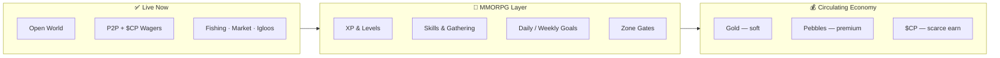
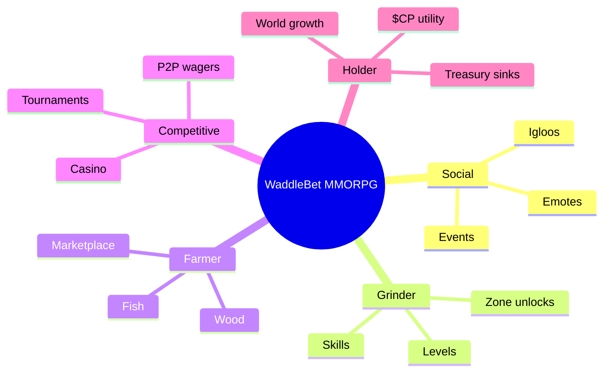
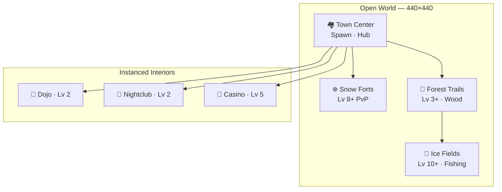
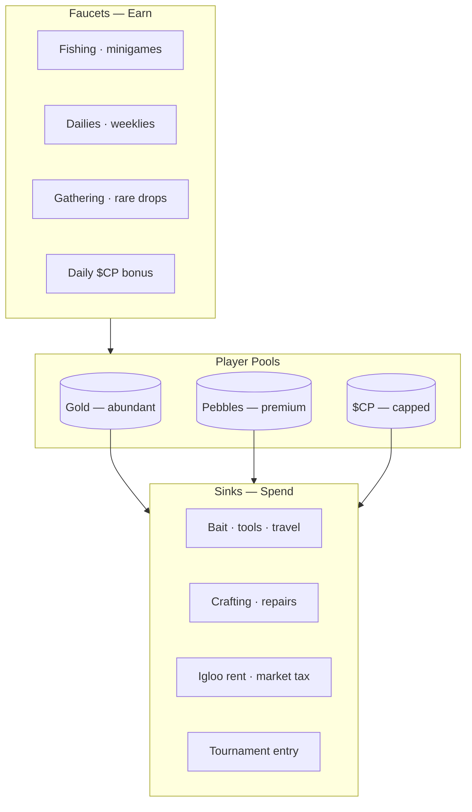
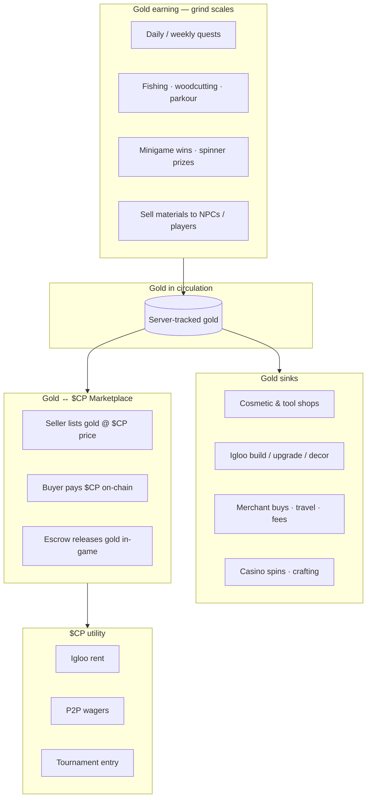
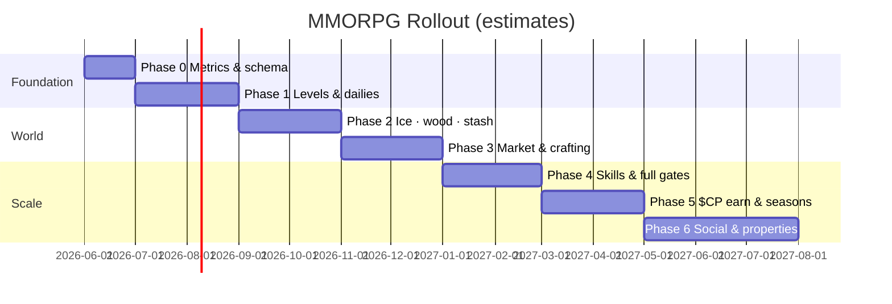
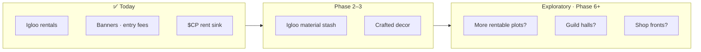

<p align="center">
  <strong>WaddleBet MMORPG Roadmap</strong><br/>
  <em>Progression · Economy · World Expansion</em>
</p>

<p align="center">
  <code>v1.2</code> · June 2026 · Investors · Partners · Core Team
</p>

---

## Table of Contents

1. [Executive Summary](#executive-summary)
2. [Vision & Player Types](#vision--player-types)
3. [What's Live Today](#whats-live-today)
4. [World Map & Zone Gates](#world-map--zone-gates)
5. [Economy Design](#economy-design)
6. [Gold-Backed Economy & $CP Bridge](#gold-backed-economy--cp-bridge)
7. [Core Gameplay Loops](#core-gameplay-loops)
8. [Phased Delivery](#phased-delivery)
9. [Property & Igloos](#property--igloos)
10. [Safeguards & Metrics](#safeguards--metrics)
11. [Investor Narrative](#investor-narrative)

---

## Executive Summary

WaddleBet is evolving from a **social wagering hub** into a **lightweight MMORPG** — a persistent multiplayer world where players **level up**, **unlock zones**, **gather resources**, complete **daily & weekly challenges**, and participate in a **$CP-backed circulating economy**.

> **We are not starting over.** Multiplayer world, P2P games, ice fishing, marketplace, igloo rentals, and daily $CP rewards are **already live**. This roadmap **extends** them.

### Design principles

| Principle | What it means |
|-----------|----------------|
| **Progression before profit** | Level & time gates reduce bots; reward real players |
| **Reward the grind** | Gold scales with play time and skill — no daily gold caps on active activities |
| **Simple loops, done well** | Fish, chop, quest, trade — not 50 interconnected systems on day one |
| **Farmers + social players** | Gatherers create supply; hangouts create retention |
| **Ship in phases** | Every phase = playable product + measurable KPIs |



---

## Vision & Player Types

> *Club Penguin–simple social world with Web3 depth: walk with friends, fish on the ice, chop wood in the forest, minigame for XP, list loot on the market, earn capped **$CP** through gameplay.*



---

## What's Live Today

| System | Status | Notes |
|:-------|:------:|:------|
| Open world zones | ✅ | Town Center, Snow Forts, Forest Trails |
| P2P minigames + $CP wagers | ✅ | Custodial settlement, 5% rake |
| Ice fishing | ✅ | Town pond today → moves to Ice zone |
| Cosmetic inventory | ✅ | Slots, equip, NFT mint |
| Pebble marketplace | ✅ | Player-to-player cosmetics |
| Igloo rentals | ✅ | $CP rent, banners, entry fees |
| Daily $CP bonus | ✅ | 1 hr session, 24 h cooldown |
| **Player XP / levels** | ❌ | Planned Phase 1 |
| **Skills** | ❌ | Planned Phase 2–4 |
| **Material inventory** | ❌ | Planned Phase 2 |
| **Harvestable forest** | ❌ | Planned Phase 2 |
| **Daily / weekly quests** | ❌ | Planned Phase 1–3 |

---

## World Map & Zone Gates

Progression gates create **milestones**, **anti-bot friction**, and **reasons to grind**.



### Proposed level requirements

| Destination | Min level | Activity |
|:------------|:---------:|:---------|
| Forest Trails (full) | **3** | Woodcutting |
| Nightclub / Dojo | **2** | Social · Card Jitsu |
| Casino interior | **5** | House games · slots |
| Snow Forts battles | **8** | PvP (when live) |
| **Ice Fields** (fishing) | **10** | Fishing moves here |
| High-stakes lounge | **15** | Premium $CP wagers |

Denied entry shows a friendly gate UI: *"Reach level 10 to enter the Ice Fields."*

---

## Economy Design

Three currencies, three roles — **gold circulates**, **$CP stays scarce**.



| Currency | Role | Earn | Spend |
|:---------|:-----|:-----|:------|
| **Gold** | Soft loop currency — **grind-friendly** | Fishing, skills, minigames, materials, quests (bonus layer) | Bait, tools, igloo build, upgrades, fees |
| **Pebbles** | Premium bridge | SOL purchase, events | Gacha, marketplace, boosts |
| **$CP** | On-chain utility | Capped weekly pools, achievements, daily bonus | Igloo rent, wagers, tournaments |

**Currency rules:**

| Currency | Earn philosophy |
|:---------|:----------------|
| **Gold** | **Reward grinders.** No hard daily/weekly gold caps on active play — fishing, woodcutting, minigames, and material sales scale with time and skill. Sustainability comes from **sinks**, **house edge**, and the **gold ↔ $CP market** absorbing surplus — not from punishing long sessions. |
| **$CP** | **Stay scarce.** Weekly pools, achievements, and daily bonus remain capped — on-chain rewards are not unlimited. |

**Materials** (wood, fish, crafted goods) are **player-generated** and **player-consumed** — organic supply & demand via marketplace (Phase 3).

> **v1.2 addition:** Gold is not only a grind currency — it becomes **tradeable for $CP** on a player-driven exchange. See [Gold-Backed Economy & $CP Bridge](#gold-backed-economy--cp-bridge) for sustainability rules and implementation detail.

---

## Gold-Backed Economy & $CP Bridge

> *WaddleBet's circulating economy: gold earned through play, $CP as on-chain utility, and a **player marketplace** that connects them — without minting unlimited gold from treasury.*

### Why this model

| Problem | How gold ↔ $CP solves it |
|:--------|:---------------------------|
| Gold feels worthless after day 1 | Players can **sell surplus gold** to buyers who need it for sinks |
| $CP feels disconnected from gameplay | Buyers earn gold through play; sellers monetize time |
| Pure P2P wagering only | Adds **farming, crafting, and social** paths to the same economy |
| Unsustainable token farming | $CP gameplay earn stays capped; gold surplus exits via **player listings**, not treasury mint |

**Core rule:** WaddleBet never sells gold for $CP from treasury at a fixed rate. **Price discovery is player-set** on the in-game gold exchange. The platform provides escrow, fees, and anti-abuse — not a money printer.

### Currency roles (Waddle mapping)

| Layer | Currency | Real value? | Primary use |
|:------|:---------|:-------------|:------------|
| **Soft loop** | **Gold** (coins) | Indirect — via player listings | Shops, building, bait, repairs, NPC fees |
| **Premium bridge** | **Pebbles** | SOL-backed (existing) | Gacha, cosmetic GE, instant UX |
| **On-chain** | **$CP** | Yes — SPL token | Igloo rent, wagers, **buying gold**, tournaments |
| **Materials** | Wood, fish, coal, stone | Player markets (Phase 3) | Crafting, building, merchant arbitrage |



### Gold-for-$CP marketplace (requirements)

This is the **monetization bridge** — sellers list in-game gold in exchange for $CP at a **USD-anchored or seller-chosen price**; buyers pay from wallet.

| Requirement | Detail |
|:------------|:-------|
| **Escrow** | Listed gold deducted from seller balance on list; held until sale or cancel |
| **Settlement** | Buyer $CP transfer verified on-chain (same infra as P2P wagers / igloo rent) |
| **Pricing** | Seller sets total $CP for bundle (e.g. 50,000 gold @ 120 $CP); optional USD hint via spot oracle |
| **Fees** | 5% platform rake in $CP (aligns with wager rake) |
| **Limits** | Daily list/buy caps per wallet; min account level (e.g. Lv 5 sell, Lv 3 buy) |
| **No mint** | Server never creates gold when $CP is spent — only **transfers existing gold** |
| **No redeem** | Cannot convert gold → $CP without a **matched buyer** (prevents one-way drain) |
| **Audit** | Every trade logged in `Transaction` with `type: 'gold_market_*'` |

**Example trade**

```
Seller (grinder): Lists 100,000 gold @ 200 $CP (~$2.00 if $CP = $0.01)
Buyer (new player): Needs gold for igloo decor + bait
  → Pays 200 $CP from wallet
  → Receives 100,000 gold in-game
  → Platform keeps 10 $CP rake
Seller: Cashed out playtime; Buyer: Skips early grind — both voluntary
```

### Gold earning — reward the grind

Gold is the currency of **time and skill**. Players who put in more hours should earn more — WaddleBet does not throttle that with per-account daily gold budgets.

**Design split**

| Category | Examples | Limit style |
|:---------|:---------|:------------|
| **Unlimited grind** (core loop) | Ice fishing, woodcutting, material flips, skilled minigame play, gold-bet casino | Scales with skill, tools, and session length — **no daily gold cap** |
| **Bonus stipends** (on top) | Daily quest completion, free daily spinner, one-time achievements | Small, fixed rewards — **caps apply here only**, not to your grind |
| **Monetization outlet** | List surplus gold for $CP on the player exchange | Grinders cash out excess; buyers skip early progression |

**Grind paths (uncapped gold potential)**

| Source | How more play = more gold |
|:-------|:--------------------------|
| **Fishing** | Higher Fishing skill → rarer catches → higher vendor gold; longer sessions = more casts |
| **Woodcutting** | Better axes (crafted) + skill → faster cycles; trees respawn but **no daily chop limit** |
| **Materials** | Sell wood/fish/coal to NPCs or players — arbitrage rewards market-savvy grinders |
| **Minigames** | Repeatable solo wins (gold side pots); P2P wagers stay in **$CP** |
| **Casino gold slots** | Repeatable 25g spins (live); house edge ~7% recycles gold — grinders accept variance |
| **Weekly challenges** | Large **bonus** payouts for hard goals (e.g. *wager 3 players in 3 game types*) — additive, not a replacement for grinding |

**Daily quests = bonus, not allowance**

Dailies are a **stipend on top** of uncapped activities — not the primary gold income and not a hidden daily ceiling.

```
┌─────────────────────────────────────────────────────────┐
│ Daily Bonuses — reset midnight UTC (stipend layer)      │
├─────────────────────────────────────────────────────────┤
│ ☐ Win 2 games (any P2P minigame)           +400 gold   │
│ ☐ Wager 3 different players (3 game types)   +800 gold   │
│ ☐ Catch 5 fish OR chop 10 wood               +300 gold   │
│ ★ Perfect day (all 3)                        +50 $CP cap │
├─────────────────────────────────────────────────────────┤
│ Your fishing / chopping / trading today:   UNLIMITED   │
└─────────────────────────────────────────────────────────┘
```

*Perfect-day $CP uses existing daily-bonus discipline (session floor, 24h cooldown, wallet auth). Gold from active grind is separate.*

**Why this stays sustainable without punishing grinders**

1. **Sinks scale** — igloo tiers, crafting, repairs, and consumables cost more as players progress.
2. **House edge** — casino gold returns &lt; 100% over volume (documented RTP).
3. **NPC spreads** — merchants buy materials below sell price; infinite vendor arbitrage is impossible.
4. **Gold ↔ $CP market** — surplus from top grinders becomes **listed supply**; price discovery absorbs inflation pressure.
5. **Skill gates** — rare fish, high parkour tiers, and P2P wins favor real players over bots.
6. **Telemetry, not throttles** — ops watch **economy-wide** gold in/out; tune sinks and NPC prices before ever touching grind rates.

### Gold sinks (Waddle implementations)

Sinks must keep pace with **economy-wide** gold creation (especially from grinders). Individual players are never penalized for playing longer — excess gold should flow into **builds, consumables, casino edge**, or **$CP listings**.

| Sink | Example | Phase |
|:-----|:--------|:------|
| **Personal igloo build** | Claim plot → foundation 5,000g → walls 10,000g → roof 15,000g | Phase 2–6 |
| **Igloo decor & utility** | Stash locker 2,000g · firepit 800g · dance floor 5,000g · banner upgrade 1,000g | Phase 2+ |
| **Rent remains $CP** | Igloo *rental* stays on-chain (holder utility); **build/upkeep** burns gold | Live + extend |
| **Cosmetic shop (gold)** | Non-gacha hats, emotes, furniture — rotating stock | Phase 1 |
| **Tools & consumables** | Fishing bait, axes, repair kits — NPC vendors | Phase 2–3 |
| **Crafting fees** | Wood + fish → furniture; gold fee per craft | Phase 3 |
| **Travel / fast travel** | Bus to Ice Fields 50g; skip gate timer 200g | Phase 4 |
| **Merchant buy orders** | NPC buys wood/fish at **below** sell price (spread = sink) | Phase 3 |
| **Casino gold slots** | 25g bet, ~93% RTP (live) — house edge recycles gold | Live |
| **Quality reroll / holo** | Burn gold on cosmetic upgrades (planned) | Phase 3 |
| **Inventory slots** | Gold cost per extra stash tab | Planned |

**Igloo progression example**

```
New player (Lv 5+, quest: "Find your plot")
  → Pay 5,000 gold for foundation permit
  → Gather 50 wood (Forest) + 20 stone (future mine) + 3,000 gold for walls
  → Unlock stash (materials separate from cosmetics)
  → Host friends; optional entry fee in gold or $CP
  → Ongoing upkeep: 200 gold / week or decor decays (light sink)
```

### Materials layer (wood · fish · coal · stone)

Resources flow **around** gold — they create depth without replacing the gold ↔ $CP bridge.

| Resource | Source | Sink | Trade |
|:---------|:-------|:-----|:------|
| Wood | Forest Trails trees | Building, crafting, firepits | Player market + NPC spread |
| Fish | Ice Fields / Town pond | Cooking, quests, merchant | Perishable optional (Phase 4+) |
| Coal | Rare fishing / future mine | Smelting, casino events | High-value bulk listings |
| Stone | Future quarry zone | Igloo tier 2+ builds | Guild projects (Phase 6) |

Merchants publish **buy and sell** prices that move slowly with server-wide volume — creating arbitrage for farmers without unlimited gold creation.

### Sustainability requirements

> **If any of these fail, the economy breaks.** Treat as engineering + live-ops requirements, not suggestions.

| # | Requirement | Rationale |
|:-:|:------------|:----------|
| 1 | **Economy-wide telemetry** — track total gold created vs destroyed daily | Tune sinks and NPC prices from data; **not** per-player gold budgets |
| 2 | **Sink coverage** — weekly gold destroyed ≥ 90% of gold created (server aggregate) | Measured via `Transaction` aggregates |
| 3 | **No fixed gold↔$CP peg** | Fixed mint/redemption = arbitrage bot paradise |
| 4 | **Escrow-only bridge** | Gold and $CP move atomically; no partial trades |
| 5 | **Level + wallet gates** on marketplace | Reduces fresh-wallet RMT and bot resale |
| 6 | **$CP gameplay earn stays capped** | Gold bridge ≠ unlimited $CP; separate pools |
| 7 | **Custodial runway** | Treasury for quest $CP, not for buying back unlimited gold |
| 8 | **House edge on all casino gold** | RTP &lt; 100%; documented (see `goldSlots.js`) |
| 9 | **NPC price floors/ceilings** | Materials cannot be vendored into infinite gold |
| 10 | **Sink tuning lever** | Ops adjust vendor prices, craft costs, or build fees — **before** touching grind earn rates |

**Steady-state target**

```
Net gold/day ≈ 0 (±5%) — economy-wide, not per-player
Top grinders can accumulate gold; surplus listed on gold ↔ $CP market
Gold market $CP price stable week-over-week (±15%)
Active gold listings > 50 (liquidity indicator)
Buyer/seller ratio 0.4–2.5 (healthy two-sided market)
```

### What NOT to do

| Anti-pattern | Why |
|:-------------|:----|
| Sell gold from treasury for $CP | One-way pressure; holders diluted |
| **Per-account daily gold caps on grind activities** | Punishes loyal players; pushes RMT |
| Unlimited **$CP** from quests with no pool cap | Token inflation |
| Let bots farm **stipends** on fresh wallets | RMT supply flood — gate wallet + level on bonuses |
| Tie igloo **rent** to gold instead of $CP | Removes core $CP sink |
| Replace Pebbles with gold for gacha | Breaks SOL-backed premium layer |

### Implementation phases (economy track)

| Phase | Economy deliverable |
|:------|:--------------------|
| **0** | Gold in/out telemetry (economy-wide); `Transaction` types for future `gold_market_*` |
| **1** | Daily quests (gold + XP only); gold cosmetic shop v1; spinner free daily spin |
| **2** | Material inventory; igloo build sinks (gold + wood); NPC sell fish/wood |
| **3** | **Gold-for-$CP marketplace v1**; material player listings; crafting fees |
| **4** | Weekly social quests (*3 wagers / 3 games*); merchant buy orders; travel fees |
| **5** | Capped $CP in weekly tiers; achievement one-shots; economy dashboard |
| **6** | Guild halls (gold + $CP); property expansion; tournament buy-in sinks |

### Relation to live systems today

| Already live | MMORPG extension |
|:-------------|:-----------------|
| Gold lobby slots (25g, server RTP) | Daily free spin + quest hooks |
| Pebble marketplace (cosmetics) | Parallel **gold market** + material market |
| Igloo rent ($CP) | Personal igloo **build** (gold + materials) |
| Daily $CP bonus (1h session) | Separate from gold; perfect-day quest bonus stays capped |
| P2P $CP wagers | Feeds weekly *wager 3 players* challenge |
| Ice fishing | Moves to Ice zone; feeds gold + material faucets |

---

## Core Gameplay Loops

### Loop 1 — Daily session (5–20 min)

```
Login → Check dailies → Fish OR chop OR minigame → Earn XP + gold → Progress bar fills
```

### Loop 2 — Weekly arc (1–4 hr)

```
Grind skills → Complete weekly tiers → Marketplace trade → Unlock next zone gate
```

### Loop 3 — Social + property

```
Rent igloo → Stash materials → Host friends → Entry fees / banners → $CP sink
```

### Systems detail

| System | Mechanic |
|:-------|:---------|
| **XP / Levels** | Account-wide; from activities + discoveries; cosmetic & gate rewards |
| **Skills** | Fishing, Woodcutting, Parkour — higher skill = better yield / odds |
| **Forest wood** | Interact with marked trees; respawn timers; Woodcutting skill |
| **Ice fishing** | Relocated to Ice Fields (Lv 10); rare fish → XP + weekly progress |
| **Inventory & stash** | Materials separate from cosmetics; Town locker + igloo storage |
| **Dailies** | 3–5 tasks; **bonus** gold stipend + XP; small capped $CP on perfect-day only |
| **Weeklies** | Tiered track; cosmetics, Pebbles, **$CP** at top tier (fixed weekly pool) |
| **Parkour** | Checkpoints grant XP; feeds weekly challenges |

---

## Phased Delivery

> **Start smallest.** Each phase ships playable value before the next begins.



### Phase 0 — Foundation & metrics · *2–3 weeks*

- Analytics baseline (DAU, session length, D1/D7)
- `User.progression` schema (`level`, `xp`)
- XP curve + $CP faucet/sink budget locked

### Phase 1 — Levels, HUD & first gates · *4–6 weeks*

- XP from fishing, minigames, capped playtime
- Level HUD + profile badge
- **Daily challenges v1** (XP + gold only)
- Ice portal gate preview (Lv 10 required)

*Out of scope:* woodcutting, materials, $CP from quests

### Phase 2 — Ice zone, materials & stash · *6–8 weeks*

- **Ice Fields** zone; fishing moves from Town pond
- Fishing skill v1
- **Woodcutting** in Forest Trails (10–20 trees)
- Material inventory + Town stash + igloo storage
- Gates: Forest L3, Ice L10, Casino L5

### Phase 3 — Marketplace & crafting · *6–8 weeks*

- Material listings on marketplace (Pebbles / gold)
- **Gold-for-$CP exchange v1** (escrow listings, on-chain buy, 5% rake)
- NPC vendors (price floors)
- Crafting v1: wood → tools → better fishing
- **Weekly challenges** + small capped **$CP** at Gold tier

### Phase 4 — Skills depth & zone pack · *6–8 weeks*

- Skills UI (Fishing, Woodcutting, Parkour)
- Parkour checkpoints
- Full interior gate table (Nightclub L2, Dojo L2, etc.)
- Snow Forts PvP gate (Lv 8)

### Phase 5 — $CP gameplay earn & seasons · *8–10 weeks*

- Fixed weekly $CP pool (custodial)
- One-time achievement $CP (Lv 10, 20, rare catches)
- Season pass (light)
- Leaderboards + admin economy dashboard

### Phase 6 — Social MMORPG layer · *ongoing*

- Guilds / parties + group weeklies
- World events (double XP, rare spawns)
- Tournament seasons
- **Property expansion** *(see below)*
- Mobile UX polish

---

## Property & Igloos

**Igloo rentals are the foundation** — live today with $CP rent, customization, entry fees, and stash potential (Phase 2).

Community feedback shows appetite for **owning more properties**. We are **flexible** on format; no commitment to a specific housing system until Phases 1–3 prove retention.



| Option | Pros | Status |
|:-------|:-----|:-------|
| **More igloo slots / tiers** | Reuses existing system | Likely |
| **New zone plots** (forest cabins, ice huts) | Fresh gathering + social hubs | Exploring |
| **Guild-owned spaces** | Social retention | Exploring |
| **Full player housing sim** | High scope | Deferred unless demand clear |

> **Decision gate:** Evaluate property expansion after Phase 3 marketplace metrics and community surveys.

---

## Safeguards & Metrics

| Risk | Mitigation |
|:-----|:-----------|
| Bot farming | Wallet auth, level gates, session floors for $CP, rate limits |
| Gold inflation | Scaling sinks (build tiers, craft fees), NPC spreads, house edge, gold market supply absorption, **economy telemetry** |
| Gold market RMT | Escrow, anti-bot stipend gates, min levels, no treasury gold sales |
| $CP inflation | Weekly caps, fixed pools, no uncapped quest $CP rewards |
| $CP/gold price crash | Sink tuning + healthy listing volume from grinders — not player earn throttles |
| Dupes | Server-authoritative inventory; atomic DB updates |

**Custodial wallet** funds $CP gameplay rewards — must be topped up separately from daily bonus runway.

### KPI targets (directional)

| Phase | Target |
|:------|:-------|
| 1 | +20% session time; 40% reach Lv 5 in week 1 |
| 2 | 30% DAU use stash; 10% chop wood daily |
| 3 | Active material market; economy-wide gold sink ≥ creation; **gold↔$CP market live** |
| 4 | 25% complete weekly Bronze tier |
| 5 | $CP claims correlate with retention |

---

## Investor Narrative

1. **Shipped, not vaporware** — Multiplayer world, $CP economy, marketplace, fishing, igloos are live.
2. **MMORPG layer = retention** — Levels and gates turn holders into players and players into long-term community.
3. **Phased delivery** — Each quarter ships measurable product; roadmap is public.
4. **Economy by design** — Gold rewards grinders; surplus trades on the **$CP market**; sinks and house edge keep the economy balanced without session caps.
5. **Club Penguin heart + Web3 depth** — Familiar loop, differentiated by ownership and on-chain rewards.

### Competitor lessons applied

| Lesson | Our response |
|:-------|:-------------|
| Progression before extractable value | Level gates on ice, casino, high-stakes |
| Marketplace liquidity | Phase 3 materials on existing Pebble infra |
| Simple > complex | Chop · fish · daily · trade first |
| Transparent roadmap | This doc + whitepaper + changelog |
| Imperfect but updating | Phase 1 is small; iterate from data |

---

<p align="center">
  <strong>Full doc:</strong>
  <a href="https://github.com/Tanner253/ClubPengu/blob/main/waddlebet/docs/MMORPG_ROADMAP.md">github.com/Tanner253/ClubPengu · MMORPG_ROADMAP.md</a>
</p>

<p align="center">
  <em>Engineering tickets should reference phase IDs (e.g. <code>MMO-P2: Woodcutting v1</code>).</em>
</p>
