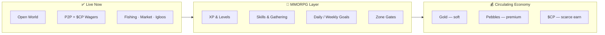
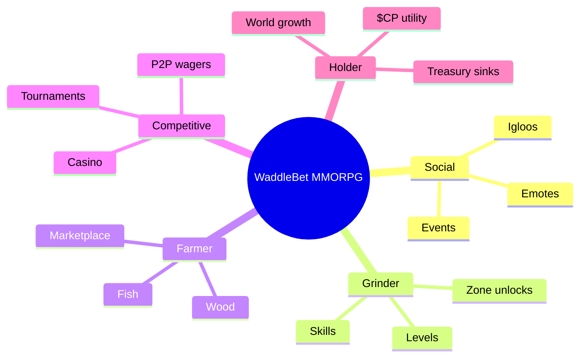
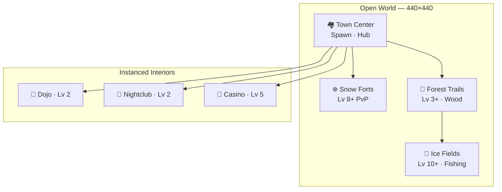
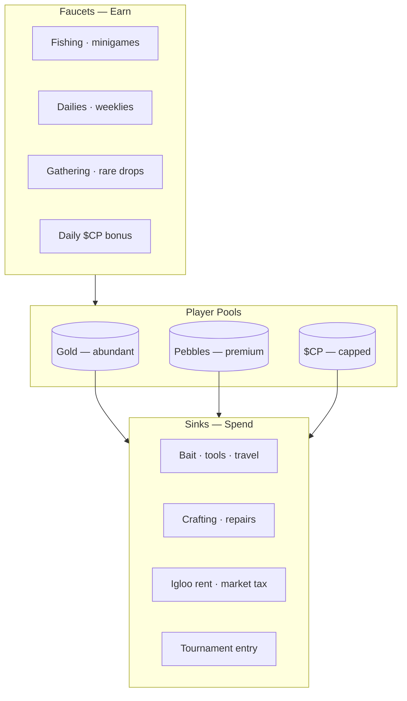
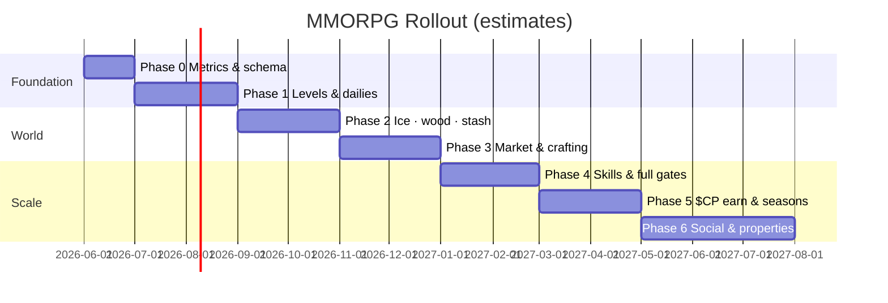
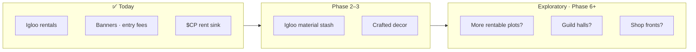

<p align="center">
  <strong>WaddleBet MMORPG Roadmap</strong><br/>
  <em>Progression · Economy · World Expansion</em>
</p>

<p align="center">
  <code>v1.1</code> · June 2026 · Investors · Partners · Core Team
</p>

---

## Table of Contents

1. [Executive Summary](#executive-summary)
2. [Vision & Player Types](#vision--player-types)
3. [What's Live Today](#whats-live-today)
4. [World Map & Zone Gates](#world-map--zone-gates)
5. [Economy Design](#economy-design)
6. [Core Gameplay Loops](#core-gameplay-loops)
7. [Phased Delivery](#phased-delivery)
8. [Property & Igloos](#property--igloos)
9. [Safeguards & Metrics](#safeguards--metrics)
10. [Investor Narrative](#investor-narrative)

---

## Executive Summary

WaddleBet is evolving from a **social wagering hub** into a **lightweight MMORPG** — a persistent multiplayer world where players **level up**, **unlock zones**, **gather resources**, complete **daily & weekly challenges**, and participate in a **$CP-backed circulating economy**.

> **We are not starting over.** Multiplayer world, P2P games, ice fishing, marketplace, igloo rentals, and daily $CP rewards are **already live**. This roadmap **extends** them.

### Design principles

| Principle | What it means |
|-----------|----------------|
| **Progression before profit** | Level & time gates reduce bots; reward real players |
| **Simple loops, done well** | Fish, chop, quest, trade — not 50 interconnected systems on day one |
| **Farmers + social players** | Gatherers create supply; hangouts create retention |
| **Ship in phases** | Every phase = playable product + measurable KPIs |



---

## Vision & Player Types

> *Club Penguin–simple social world with Web3 depth: walk with friends, fish on the ice, chop wood in the forest, minigame for XP, list loot on the market, earn capped **$CP** through gameplay.*



---

## What's Live Today

| System | Status | Notes |
|:-------|:------:|:------|
| Open world zones | ✅ | Town Center, Snow Forts, Forest Trails |
| P2P minigames + $CP wagers | ✅ | Custodial settlement, 5% rake |
| Ice fishing | ✅ | Town pond today → moves to Ice zone |
| Cosmetic inventory | ✅ | Slots, equip, NFT mint |
| Pebble marketplace | ✅ | Player-to-player cosmetics |
| Igloo rentals | ✅ | $CP rent, banners, entry fees |
| Daily $CP bonus | ✅ | 1 hr session, 24 h cooldown |
| **Player XP / levels** | ❌ | Planned Phase 1 |
| **Skills** | ❌ | Planned Phase 2–4 |
| **Material inventory** | ❌ | Planned Phase 2 |
| **Harvestable forest** | ❌ | Planned Phase 2 |
| **Daily / weekly quests** | ❌ | Planned Phase 1–3 |

---

## World Map & Zone Gates

Progression gates create **milestones**, **anti-bot friction**, and **reasons to grind**.



### Proposed level requirements

| Destination | Min level | Activity |
|:------------|:---------:|:---------|
| Forest Trails (full) | **3** | Woodcutting |
| Nightclub / Dojo | **2** | Social · Card Jitsu |
| Casino interior | **5** | House games · slots |
| Snow Forts battles | **8** | PvP (when live) |
| **Ice Fields** (fishing) | **10** | Fishing moves here |
| High-stakes lounge | **15** | Premium $CP wagers |

Denied entry shows a friendly gate UI: *"Reach level 10 to enter the Ice Fields."*

---

## Economy Design

Three currencies, three roles — **gold circulates**, **$CP stays scarce**.



| Currency | Role | Earn | Spend |
|:---------|:-----|:-----|:------|
| **Gold** | Soft loop currency | Fish, quests, NPC sales | Bait, tools, upgrades, fees |
| **Pebbles** | Premium bridge | SOL purchase, events | Gacha, marketplace, boosts |
| **$CP** | On-chain utility | Capped weekly pools, achievements, daily bonus | Igloo rent, wagers, tournaments |

**$CP rule:** No unlimited farm loop. Every faucet has daily / weekly / account caps.

**Materials** (wood, fish, crafted goods) are **player-generated** and **player-consumed** — organic supply & demand via marketplace (Phase 3).

---

## Core Gameplay Loops

### Loop 1 — Daily session (5–20 min)

```
Login → Check dailies → Fish OR chop OR minigame → Earn XP + gold → Progress bar fills
```

### Loop 2 — Weekly arc (1–4 hr)

```
Grind skills → Complete weekly tiers → Marketplace trade → Unlock next zone gate
```

### Loop 3 — Social + property

```
Rent igloo → Stash materials → Host friends → Entry fees / banners → $CP sink
```

### Systems detail

| System | Mechanic |
|:-------|:---------|
| **XP / Levels** | Account-wide; from activities + discoveries; cosmetic & gate rewards |
| **Skills** | Fishing, Woodcutting, Parkour — higher skill = better yield / odds |
| **Forest wood** | Interact with marked trees; respawn timers; Woodcutting skill |
| **Ice fishing** | Relocated to Ice Fields (Lv 10); rare fish → XP + weekly progress |
| **Inventory & stash** | Materials separate from cosmetics; Town locker + igloo storage |
| **Dailies** | 3–5 tasks; XP + gold; small $CP only on perfect-day bonus (capped) |
| **Weeklies** | Tiered track; cosmetics, Pebbles, **$CP** at top tier (fixed weekly pool) |
| **Parkour** | Checkpoints grant XP; feeds weekly challenges |

---

## Phased Delivery

> **Start smallest.** Each phase ships playable value before the next begins.



### Phase 0 — Foundation & metrics · *2–3 weeks*

- Analytics baseline (DAU, session length, D1/D7)
- `User.progression` schema (`level`, `xp`)
- XP curve + $CP faucet/sink budget locked

### Phase 1 — Levels, HUD & first gates · *4–6 weeks*

- XP from fishing, minigames, capped playtime
- Level HUD + profile badge
- **Daily challenges v1** (XP + gold only)
- Ice portal gate preview (Lv 10 required)

*Out of scope:* woodcutting, materials, $CP from quests

### Phase 2 — Ice zone, materials & stash · *6–8 weeks*

- **Ice Fields** zone; fishing moves from Town pond
- Fishing skill v1
- **Woodcutting** in Forest Trails (10–20 trees)
- Material inventory + Town stash + igloo storage
- Gates: Forest L3, Ice L10, Casino L5

### Phase 3 — Marketplace & crafting · *6–8 weeks*

- Material listings on marketplace (Pebbles / gold)
- NPC vendors (price floors)
- Crafting v1: wood → tools → better fishing
- **Weekly challenges** + small capped **$CP** at Gold tier

### Phase 4 — Skills depth & zone pack · *6–8 weeks*

- Skills UI (Fishing, Woodcutting, Parkour)
- Parkour checkpoints
- Full interior gate table (Nightclub L2, Dojo L2, etc.)
- Snow Forts PvP gate (Lv 8)

### Phase 5 — $CP gameplay earn & seasons · *8–10 weeks*

- Fixed weekly $CP pool (custodial)
- One-time achievement $CP (Lv 10, 20, rare catches)
- Season pass (light)
- Leaderboards + admin economy dashboard

### Phase 6 — Social MMORPG layer · *ongoing*

- Guilds / parties + group weeklies
- World events (double XP, rare spawns)
- Tournament seasons
- **Property expansion** *(see below)*
- Mobile UX polish

---

## Property & Igloos

**Igloo rentals are the foundation** — live today with $CP rent, customization, entry fees, and stash potential (Phase 2).

Community feedback shows appetite for **owning more properties**. We are **flexible** on format; no commitment to a specific housing system until Phases 1–3 prove retention.



| Option | Pros | Status |
|:-------|:-----|:-------|
| **More igloo slots / tiers** | Reuses existing system | Likely |
| **New zone plots** (forest cabins, ice huts) | Fresh gathering + social hubs | Exploring |
| **Guild-owned spaces** | Social retention | Exploring |
| **Full player housing sim** | High scope | Deferred unless demand clear |

> **Decision gate:** Evaluate property expansion after Phase 3 marketplace metrics and community surveys.

---

## Safeguards & Metrics

| Risk | Mitigation |
|:-----|:-----------|
| Bot farming | Wallet auth, level gates, session floors for $CP, rate limits |
| Gold inflation | NPC floors/ceilings, repair sinks, scaling vendors |
| $CP inflation | Weekly caps, fixed pools, no uncapped quest rewards |
| Dupes | Server-authoritative inventory; atomic DB updates |

**Custodial wallet** funds $CP gameplay rewards — must be topped up separately from daily bonus runway.

### KPI targets (directional)

| Phase | Target |
|:------|:-------|
| 1 | +20% session time; 40% reach Lv 5 in week 1 |
| 2 | 30% DAU use stash; 10% chop wood daily |
| 3 | Active material market; gold sink ≥ faucet |
| 4 | 25% complete weekly Bronze tier |
| 5 | $CP claims correlate with retention |

---

## Investor Narrative

1. **Shipped, not vaporware** — Multiplayer world, $CP economy, marketplace, fishing, igloos are live.
2. **MMORPG layer = retention** — Levels and gates turn holders into players and players into long-term community.
3. **Phased delivery** — Each quarter ships measurable product; roadmap is public.
4. **Economy by design** — Gold circulates; $CP is scarce; farmers and social players coexist.
5. **Club Penguin heart + Web3 depth** — Familiar loop, differentiated by ownership and on-chain rewards.

### Competitor lessons applied

| Lesson | Our response |
|:-------|:-------------|
| Progression before extractable value | Level gates on ice, casino, high-stakes |
| Marketplace liquidity | Phase 3 materials on existing Pebble infra |
| Simple > complex | Chop · fish · daily · trade first |
| Transparent roadmap | This doc + whitepaper + changelog |
| Imperfect but updating | Phase 1 is small; iterate from data |

---

<p align="center">
  <strong>Full doc:</strong>
  <a href="https://github.com/Tanner253/ClubPengu/blob/main/waddlebet/docs/MMORPG_ROADMAP.md">github.com/Tanner253/ClubPengu · MMORPG_ROADMAP.md</a>
</p>

<p align="center">
  <em>Engineering tickets should reference phase IDs (e.g. <code>MMO-P2: Woodcutting v1</code>).</em>
</p>
