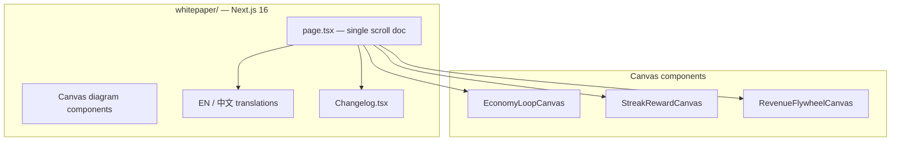

# Waddlebet Whitepaper

<div align="center">

**The public face of Waddlebet** — tokenomics, economy design, platform vision, and live changelog.

[](https://whitepaper.waddle.bet)
[](https://waddle.bet)

</div>

---

## What this site is

Not a PDF buried on Google Drive. A **living Next.js document** that updates as the game ships — with animated canvas diagrams, bilingual support (EN / 中文), and a changelog that tracks every major release.

If someone asks *"what is Waddlebet and why does $CP exist?"* — this is the answer.

---

## What's inside

### The vision
Club Penguin energy meets Solana ownership. A social MMO where you gather, wager, customize, and earn — with real token utility, not vaporware metrics.

### $CP tokenomics
Whale nametags, igloo rent, SPL wagers, cosmetic bazaar, cult collabs. Tier tables from Standard → Legendary. P2P payment rails via x402. The token has **jobs** in the ecosystem, not just a chart.

### Platform economics (Chapter 07)
The shipped closed-loop economy — explained with **canvas diagrams**:

| Visual | What it shows |
|--------|---------------|
| **Economy Loop Canvas** | Gather → gear → contracts → gold → $CP → sinks |
| **Streak Reward Canvas** | 7-day calendar — escalating $CP + gold-only bonus days |
| **Revenue Flywheel Canvas** | Wager rake → reinvest → grow |

Dual-currency design: infinite soft gold for gameplay, capped on-chain $CP for ownership and property. NPC loops that reward long-term gathering without inflating the token.

### Gacha & cosmetics
Drop rates, rarity tiers, Pebbles economy, tradeable cosmetic vision. Separate from the grind cash-out path by design.

### MMORPG direction
Progression, gathering, zones, skills — where the game is heading without pretending it's all live today.

### Changelog
Versioned release notes (v1.3.x+) covering the economy pivot, overworld expansion, merchant UI, streak calendar, and performance passes. Updated when features ship.

---

## Architecture



Built with **Next.js**, **TypeScript**, **Framer Motion**, **Tailwind CSS**. Canvas diagrams render at 2x DPR for crisp visuals on retina displays.

---

## Recent content (June 2026)

The economics section was rewritten to reflect the **shipped** economy:

- Closed NPC grind loop (fish, wood, bait, ferries)
- Daily contract flow (accept → HUD → turn in)
- 7-day $CP streak with gold-only days 3 & 6
- Tier 1 balance fixes (sell math, Clive gold, onboarding axe)
- Tarkov-style merchant UI

The old emoji flywheel was replaced with **RevenueFlywheelCanvas**. The streak section uses **StreakRewardCanvas** instead of a static table.

---

## Run locally

```bash
npm install
npm run dev     # → http://localhost:3000
npm run build   # production build
```

Edit content in `src/app/page.tsx`, diagrams in `src/components/*Canvas.tsx`, changelog in `src/components/Changelog.tsx`.

---

## Links

| | |
|---|---|
| **Live whitepaper** | [whitepaper.waddle.bet](https://whitepaper.waddle.bet) |
| **Play the game** | [waddle.bet](https://waddle.bet) |
| **GitHub** | [Tanner253/waddlebet](https://github.com/Tanner253/waddlebet) |
| **$CP mint** | `9kdJA8Ahjyh7Yt8UDWpihznwTMtKJVEAmhsUFmeppump` (in-game) |

---

<div align="center">

*This site is the source of truth for public tokenomics. Internal build sequencing lives in `waddlebet/docs/`.*

</div>
